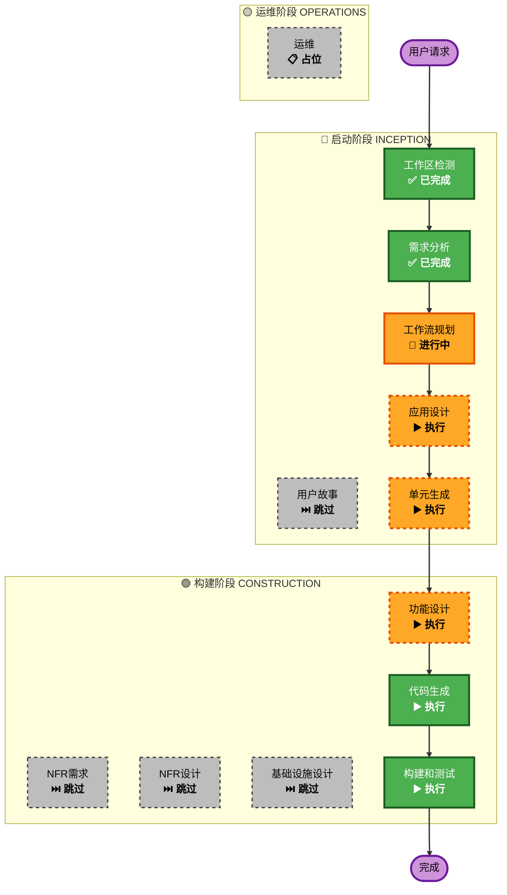

# Smart Campaign Designer 执行计划

## 详细分析摘要

### 变更影响评估
- **用户界面变更**: 是 - 全新的对话式 Web 界面
- **结构变更**: 是 - 全新系统架构（前端 + 后端 + AI + 约束求解）
- **数据模型变更**: 是 - 新的数据结构（源板、布局、Picklist）
- **API 变更**: 是 - 新的 REST API 端点
- **NFR 影响**: 是 - 性能要求（<30秒）、并发支持（1-10用户）

### 风险评估
- **风险等级**: 中等
- **回滚复杂度**: 简单（全新项目，无现有系统依赖）
- **测试复杂度**: 中等（需要验证约束求解正确性）

---

## 工作流可视化

---

## 阶段执行计划

### 🔵 启动阶段 (INCEPTION)

| 阶段 | 状态 | 理由 |
|------|------|------|
| 工作区检测 | ✅ 已完成 | 确定为 Greenfield 项目 |
| 逆向工程 | ⏭️ 跳过 | Greenfield 项目，无现有代码 |
| 需求分析 | ✅ 已完成 | 已生成完整需求规格说明书 |
| 用户故事 | ⏭️ 跳过 | 内部工具，用户类型单一，需求已足够清晰 |
| 工作流规划 | 🔄 进行中 | 当前阶段 |
| 应用设计 | ▶️ 执行 | 需要定义组件架构、API 设计、数据流 |
| 单元生成 | ▶️ 执行 | 系统需分解为多个开发单元（前端、后端、约束求解器） |

### 🟢 构建阶段 (CONSTRUCTION)

| 阶段 | 状态 | 理由 |
|------|------|------|
| 功能设计 | ▶️ 执行 | 需要详细设计约束逻辑、Agent 对话流程、数据模型 |
| NFR 需求 | ⏭️ 跳过 | 需求分析中已明确 NFR（<30秒、1-10用户） |
| NFR 设计 | ⏭️ 跳过 | 本地部署，性能要求不高，无需专门设计 |
| 基础设施设计 | ⏭️ 跳过 | 本地服务器部署，无云基础设施需求 |
| 代码生成 | ▶️ 执行 | 核心实现阶段 |
| 构建和测试 | ▶️ 执行 | 验证系统功能 |

### 🟡 运维阶段 (OPERATIONS)

| 阶段 | 状态 | 理由 |
|------|------|------|
| 运维 | 📋 占位 | 未来扩展 |

---

## 开发单元规划

系统将分解为以下开发单元：

### Unit 1: 前端 (React)
- 对话式聊天界面
- 文件上传组件
- 板布局可视化
- 下载功能

### Unit 2: 后端 (Node.js)
- REST API 端点
- 文件解析服务
- Agent 编排层
- Picklist 生成

### Unit 3: AI Agent (Bedrock)
- 对话理解
- 参数提取
- 设计建议

### Unit 4: 约束求解器 (Python OR-Tools)
- PLAID 约束实现
- 布局优化算法
- 多板类型支持

---

## 预估时间线

| 阶段 | 预估时间 |
|------|----------|
| 应用设计 | 1 轮对话 |
| 单元生成 | 1 轮对话 |
| 功能设计 | 1-2 轮对话 |
| 代码生成 | 2-3 轮对话 |
| 构建和测试 | 1 轮对话 |
| **总计** | **6-8 轮对话** |

---

## 成功标准

1. **主要目标**: 用户可通过自然语言对话设计微孔板布局并生成 Echo Picklist
2. **关键交付物**:
   - 可运行的 Web 应用
   - 对话式 AI Agent
   - PLAID 约束求解器
   - Echo Picklist 生成器
3. **质量门槛**:
   - 布局满足 PLAID 约束
   - 响应时间 < 30 秒
   - 支持 96/384/1536 孔板
